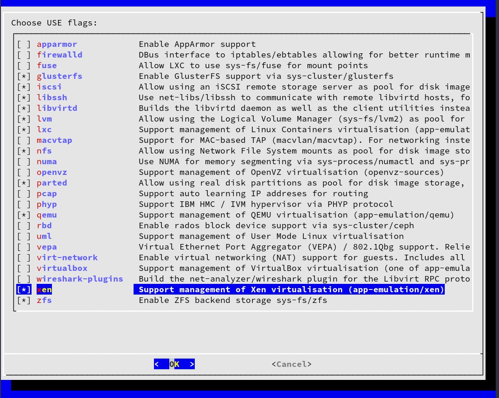

# usesh
Choose USE flags while installing software on gentoo.  Very Portmaster-esque



## Usage

This script is only for Gentoo

```bash
wget raw.githubusercontent.com/reavessm/usesh/master/use.sh
./use.sh <package to be installed>
```
